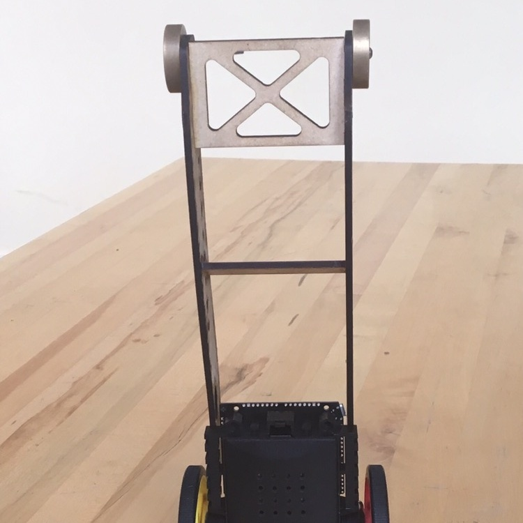
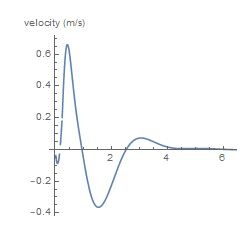

For my Quantitative Engineering Analysis class, my partner and I were given the inverted pendulum apparatus as shown to the right. Our task was to design and implement a controller so that the robot would stand up still and move foward.

In order to accomplish this task, we created a block diagram for our system illustrating how the angle controller and motor speed controller interact with the physical system of the inverted pendulum. From this block diagram we were able to calculate a tranfer function for the system and adjusted the parameters by analyzing the poles and zeros of this function.

In the end, our mathematical predictions led to a successful implementation, for the velocity and angle of our inverted pendulum experienced a fast decay towards zero velocity and displacement as well as a vertical angle. Read all the gory details in the final paper linked at the bottom of the page.

## [Click Here For Formal Paper](https://github.com/MarkG98/Rocky/blob/master/paper.pdf)

Source: <a href="https://github.com/MarkG98/Rocky"><i class="large github icon"></i>MarkG98 / Rocky</a>

 
 
 
 

<h2 style="text-align: center;">Videos</h2>

 

