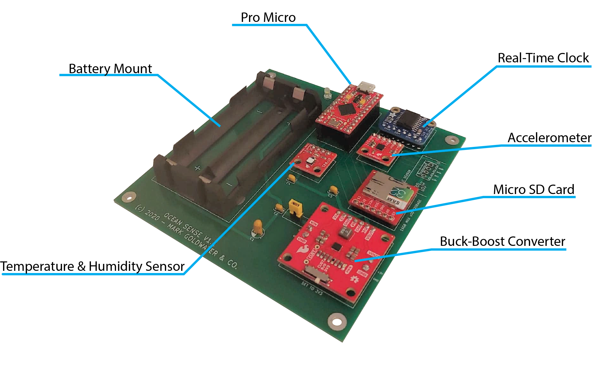
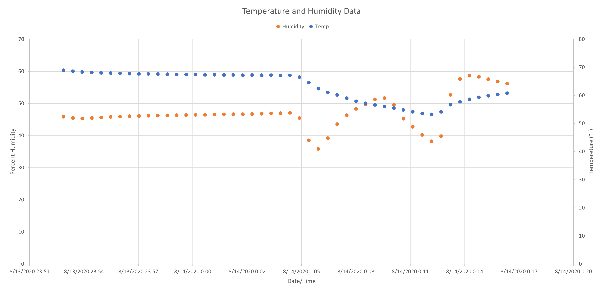
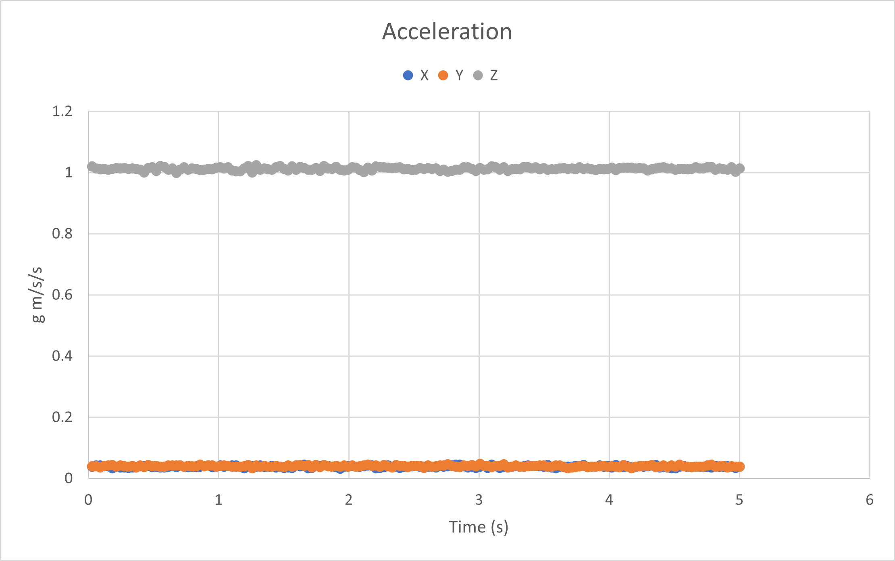

<h3>Summary</h3>

Ocean Sense is an ocean-sensing platform which can be placed on a buoy or other ocean science apparatus and sent out to sea for about one week at a time. Many ocean science experiments are run off of buoys or other devices that stand alone in the field for an extended period of time. This board serves as a packaged sensor set that measures and logs three local conditions during the experiments: <b>temperature, humidity</b>, and <b>acceleration</b>. The board sits ontop of a buoy or equivalent flotation device for the duration of an experiment and then is retrieved. To travel into the depths of the ocean, an appropriate case will need to be engineered.

<h3>Motivation</h3>

During the summer of 2020, I was a <a href="https://www.whoi.edu/what-we-do/educate/undergraduate-programs/summer-student-fellowship/" target="=_blank">Summer Student Fellow</a> at Woods Hole Oceanographic Institution (WHOI). While working on a project to automatically detect dispersive signals as a member of the <a href="http://www.oal.whoi.edu/" target="=_blank">Ocean Acoustics & Signals Lab</a>, I got to learn about the wide variety of science and engineering that pushes the development of ocean-centered technology. When it came time to begin my project during the fall 2020 academic semester in the Olin College class <i>Microcontrollers for the Real World</i>, I decided to create a platform to acompany the various ocean science experiments I learned about over the summer and measure the environmental conditions present throughout.

<h3>Project Description</h3>



Above is a labeled diagram of the Ocean Sense platform. The system is powered by two 18650 lithium-ion batteries in parellel whose nominal voltage of 3.6 V is regulated to 3 V. After the board is connected to power, <b>the white LED will hold solid as the system turns on and will then blink every two seconds as the system in taking data</b>.

<b>Every five minutes, the system will log both temperature and humidity data</b> which is written to the micro SD card every hour. <b>Every hour the system logs accelerometer data for a burst of five seconds</b> and then logs the data immediatly. After the system has been recollected simply remove the batteries and read the micro SD card using a computer to reveal the files <b>LOGA.CSV</b>, which contains a timestamp and the X, Y, Z components of acceleration and <b>LOGTH.CSV</b>, which contains a timestamp and temperature and humidity data.

There is also a <b>CONFIG.TXT</b> file which allows the user to set the date and time on the real-time clock breakout. There is a flag in the file which tells the system whether to apply it or not. A sample configuration file content can be seen below:

```
DATE=Jul 31 2020 
TIME=20:22:39
APPLY=0
```

This example configuration file prepared the system to set the clock to July 31st 2020 at the time 20:22:39, but does not apply these settings because the `APPLY` flag is set to `0` rather than `1`.

Lastly, for developers who wish to customize the board, there is an option to connect an additional I2C sensor. All the code and KiCad files are available in the <a href="https://github.com/MarkG98/Ocean_Sense" target="_blank">GitHub repository</a> to build off, and a bill of materials (BOM) can be found below.

<br>

<table class="ui celled table">
  <thead>
    <tr><th>Part</th>
    <th>Value</th>
    <th>Part Number</th>
    <th>Vendor</th>
    <th>Cost</th>
    <th>Quantity</th>
  </tr></thead>
  <tbody>
    <tr>
      <td data-label="Part">Ceramic Capacitor</td>
      <td data-label="Value">0.1uF</td>
      <td data-label="Part Number">BC1084CT-ND</td>
      <td data-label="Vendor">DigiKey</td>
      <td data-label="Cost">$ 0.04256</td>
      <td data-label="Quantity">4</td>
    </tr>
    <tr>
      <td data-label="Part">Tantalum Capacitor</td>
      <td data-label="Value">10uF</td>
      <td data-label="Part Number">399-3548-ND</td>
      <td data-label="Vendor">DigiKey</td>
      <td data-label="Cost">$ 1.41</td>
      <td data-label="Quantity">1</td>
    </tr>
    <tr>
      <td data-label="Part">LED</td>
      <td data-label="Value">--</td>
      <td data-label="Part Number">1516-QBL7IW60D-WW-ND</td>
      <td data-label="Vendor">DigiKey</td>
      <td data-label="Cost">$ 0.59</td>
      <td data-label="Quantity">1</td>
    </tr>
    <tr>
      <td data-label="Part">18650 Battery Socket</td>
      <td data-label="Value">--</td>
      <td data-label="Part Number">36-1049-ND</td>
      <td data-label="Vendor">DigiKey</td>
      <td data-label="Cost">$ 5.65</td>
      <td data-label="Quantity">1</td>
    </tr>
    <tr>
      <td data-label="Part">4-Pin Connector</td>
      <td data-label="Value">--</td>
      <td data-label="Part Number">WM4202-ND</td>
      <td data-label="Vendor">DigiKey</td>
      <td data-label="Cost">$ 0.27</td>
      <td data-label="Quantity">1</td>
    </tr>
    <tr>
      <td data-label="Part">Resistor</td>
      <td data-label="Value">4.7kΩ</td>
      <td data-label="Part Number">CF18JT4K70CT-ND</td>
      <td data-label="Vendor">DigiKey</td>
      <td data-label="Cost">$ 0.00589</td>
      <td data-label="Quantity">1</td>
    </tr>
    <tr>
      <td data-label="Part">Pro Micro - 3.3V/8MHz</td>
      <td data-label="Value">--</td>
      <td data-label="Part Number">--</td>
      <td data-label="Vendor">SparkFun</td>
      <td data-label="Cost">$ 17.95</td>
      <td data-label="Quantity">1</td>
    </tr>
    <tr>
      <td data-label="Part">SparkFun Humidity and Temperature Sensor Breakout - Si7021</td>
      <td data-label="Value">--</td>
      <td data-label="Part Number">--</td>
      <td data-label="Vendor">SparkFun</td>
      <td data-label="Cost">$ 7.95</td>
      <td data-label="Quantity">1</td>
    </tr>
    <tr>
      <td data-label="Part">SparkFun Triple Axis Accelerometer Breakout - MMA8452Q</td>
      <td data-label="Value">--</td>
      <td data-label="Part Number">--</td>
      <td data-label="Vendor">SparkFun</td>
      <td data-label="Cost">$ 10.49</td>
      <td data-label="Quantity">1</td>
    </tr>
    <tr>
      <td data-label="Part">SparkFun microSD Transflash Breakout</td>
      <td data-label="Value">--</td>
      <td data-label="Part Number">--</td>
      <td data-label="Vendor">SparkFun</td>
      <td data-label="Cost">$ 4.50</td>
      <td data-label="Quantity">1</td>
    </tr>
    <tr>
      <td data-label="Part">SparkFun Buck-Boost Converter</td>
      <td data-label="Value">--</td>
      <td data-label="Part Number">--</td>
      <td data-label="Vendor">SparkFun</td>
      <td data-label="Cost">$ 9.95</td>
      <td data-label="Quantity">1</td>
    </tr>
    <tr>
      <td data-label="Part">Adafruit DS3231 Precision RTC Breakout</td>
      <td data-label="Value">--</td>
      <td data-label="Part Number">--</td>
      <td data-label="Vendor">Adafruit</td>
      <td data-label="Cost">$ 13.95</td>
      <td data-label="Quantity">1</td>
    </tr>
    <tr>
      <td data-label="Part">Murata VTC5A 18650 2600 mAh 25 A</td>
      <td data-label="Value">--</td>
      <td data-label="Part Number">--</td>
      <td data-label="Vendor">Sony</td>
      <td data-label="Cost">$ 6.99</td>
      <td data-label="Quantity">2</td>
    </tr>
    <tr>
      <td data-label="Part">12-Pin Socket</td>
      <td data-label="Value">--</td>
      <td data-label="Part Number">PPPC121LFBN-RC</td>
      <td data-label="Vendor">DigiKey</td>
      <td data-label="Cost">$ 0.81</td>
      <td data-label="Quantity">2</td>
    </tr>
    <tr>
      <td data-label="Part">PCB</td>
      <td data-label="Value">--</td>
      <td data-label="Part Number">--</td>
      <td data-label="Vendor">JLCPCB</td>
      <td data-label="Cost">$ 7.80</td>
      <td data-label="Quantity">1</td>
    </tr>
    <tr>
      <td data-label="Part"></td>
      <td data-label="Value"></td>
      <td data-label="Part Number"></td>
      <td data-label="Vendor"></td>
      <td data-label="Cost"></td>
      <td data-label="Quantity"></td>
    </tr>
    <tr>
      <td data-label="Part"></td>
      <td data-label="Value"></td>
      <td data-label="Part Number"></td>
      <td data-label="Vendor"></td>
      <td data-label="Cost"><b>Total Cost: </b></td>
      <td data-label="Quantity"><b>$ 96.23</b></td>
    </tr>
  </tbody>
</table>

Because one of the requirements of the Ocean Sense system is to take data for a week at a time, I carried out power consumption calculations during the design phase to ensure that the system would be capable of doing so. Considering the worst case scenario for each component of the board, according to the datasheet of each integrated circuit (IC), the current draw of each are as follows:

* uSD card: 9 mA
* Accelerometer Breakout (MMA8452Q): 165 uA
* Humidity/Temperature Sensor (Si7021): 165 uA
* ATmega32U4 Microcontroller: 5.5 mA
* Voltage Regulator (TPS63070): 50 uA
* Real-Time Clock (DS3231): 200 uA

Summed, and assuming that the current spikes from data collection are brief and intermittent, the <b>total approximate current draw is 15.08 mA.</b> Given that the system is run off of two 2600 mAh batteries, this provides a <b>run time of approximately 14 days.</b> I measured a current flow of <b>14.80 mA</b> through the trace from the batteries to the voltage regulator, verifying the approximate calculations that I did based on the datasheets.   

<h3>Sample Data</h3>

Below is an example of <b>temperature</b> and <b>humidity</b> data collected from the Ocean Sense board at room temperature, then moved into a poorly cooled fridge, and then moved back to room temperature.



<br/>

Below is an example of <b>acceleration</b> data collected during one of its five second bursts. The board was sitting still at this moment which it measures 0 g of accleration in the X and Y directions and 1 g of acceleration along the Z axis.



The CSV files with the original data included in the above plots can be found in <a href="../code/LOGA.CSV">LOGA.CSV</a> and <a href="../code/LOGTH.CSV">LOGTH.CSV</a>.

<h3>Schematic</h3>


<h3>PCB Layout</h3>


<b>Source:</b> <a href="https://github.com/MarkG98/Ocean_Sense"><i class="large github icon "></i>MarkG98 / Ocean_Sense</a>