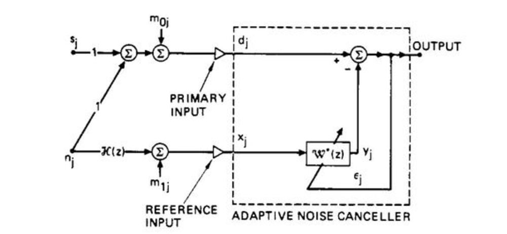

For this project I used a raspberry pi to record a the primary signal (speech and background noise) and the reference signal (only noise) simultaneously. Then, in MATLAB, I implemented the least mean squares minimization algorithm in order to filter the correlated noise recorded by the reference microphone to be as similar as possible to the noise in the primary microphone recording. Finally, this filtered noise was subtracted from the primary micrphone recording, leaving only the speech.

This post processing implementation was successful which proved that, given the proper hardware, a real-time implementation would be possible.

## [Click Here For Project Report](https://github.com/MarkG98/ActiveNoiseCancellation/blob/master/Paper.pdf)
 
Source: <a href="https://github.com/MarkG98/ActiveNoiseCancellation"><i class="large github icon"></i>MarkG98 / ActiveNoiseCancellation</a>