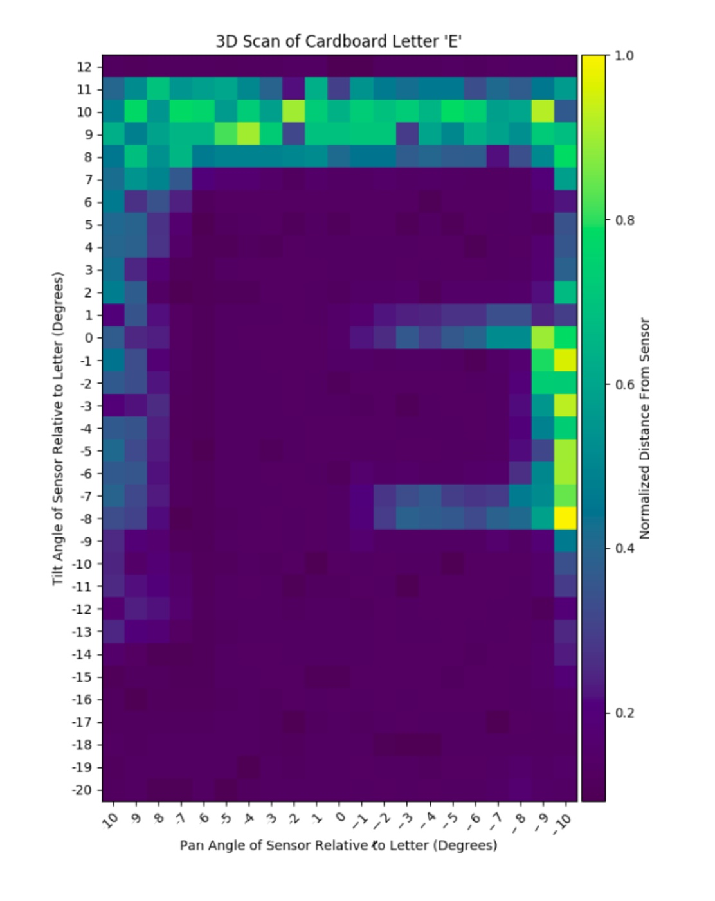

For this project, my partner and I designed and 3D printed hardware for a two-servo tilt pan mechanism in solidworks and programmed an Arduino to take scans with an IR distance sensor. I worked mainly on the software for this project. I wrote an Arduino sketch to scan a cardboard letter 'E' in columns. In other words in would scan a section of the letter from top to bottom and then pan 1 degree and do the same again.

Each of these pan and tilt angles along with their corresponding IR data were printed into the serial monitor where a Python script that I wrote read them in. This script used a calibration curve we created to turn the IR reading into a distance from the sensor as well as its position in cartesian coordinates from spherical coordinates. With these coordinates we created a heatmap of the scanned letter. For more details read the report linked below.

## [3DScanner Full Report](https://github.com/MarkG98/3DScanner/blob/master/Write-Up.pdf)

Source: <a href="https://github.com/MarkG98/3DScanner"><i class="large github icon "></i>MarkG98 / 3DScanner</a>

