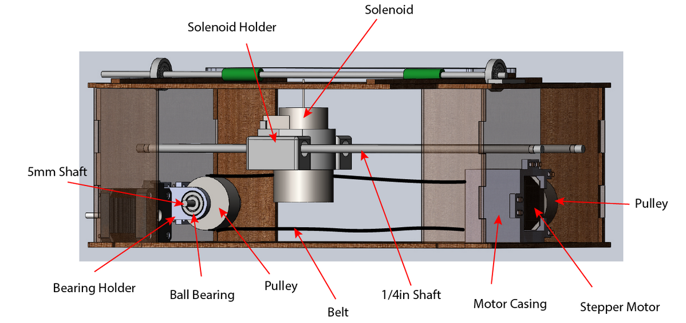
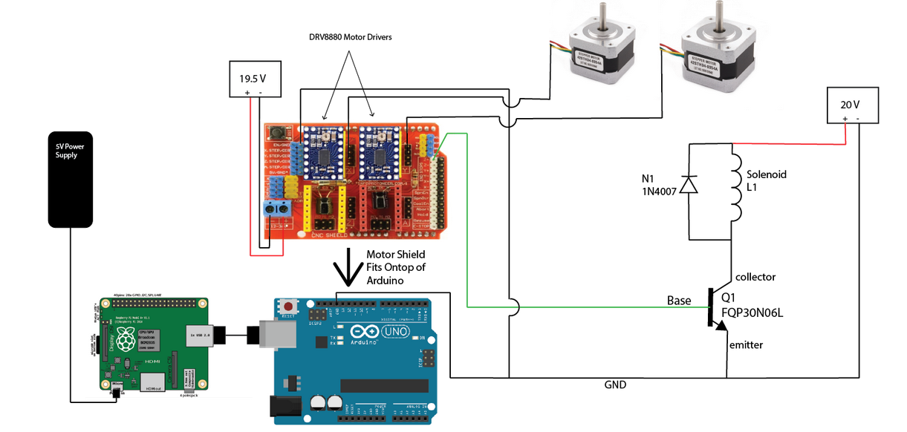

For the Principles of Engineering class at Olin College, my team and I decided to create a braille sheet music printer in an effort to make a device that could potentially make a difference for a user group.

Our team set out to develop a braille printer that can convert musical instrument digital interface files into braille sheet music. It offers an accessible way for visually impaired musicians to access digitized music and be able to have the music in sheet music format without searching in store. Musicians with visual impairment are provided with a wider range of braille sheet music to choose from, not to mention an easier path of procurement.

This project involved the integration of mechanical, software, and electrical hardware subsystems over the course of the project sprints. Details regarding the process and final product can be found at the project website [here.](http://poe.olin.edu/2018/techtile/index.html)

 
Source: <a href="https://github.com/hyegibang/Techtile"><i class="large github icon "></i>hyegibang / Techtile</a>