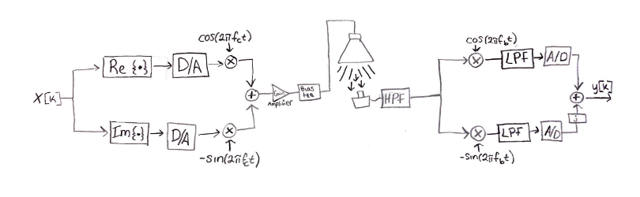
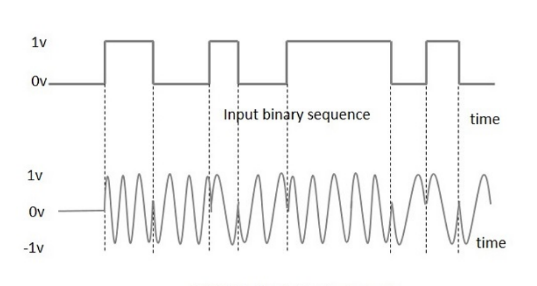

In this project, my team and I utilized two USRP1 devices in order to transmit and recieve a modulated bits which were emitted from an LED and initially received by a photodiode, hence Visible Light Communication (VLC).

Our first milestone in this project was implementing Binary Phase Shift Keying (BPSK) which only utilized the "cosine path" in the system diagram to modulate and send the signal. Next, we implemented Quadrature Phase Shift Keying (QPSK) in which two bits are modulated at once throught both the "sine path" and the "cosine path" effectivly allowing the signal to carry twice as much information.

Once challenging element of this project was the fact that the sinusoids used to modulate and demodulate the signal in each of the USRP1 devices used for Rx and Tx were not perfectly synchronized in time. This cause a frequency and phase offset in the demodulated received signal which we had to correct for. For more details read the full technical report linked below.

## [VLC System Technical Report](https://github.com/MarkG98/ADCFinalProject/blob/master/docs/ADCFinalReport.pdf)  

Source: <a href="https://github.com/MarkG98/ADCFinalProject"><i class="large github icon"></i>MarkG98 / ADCFinalProject</a>