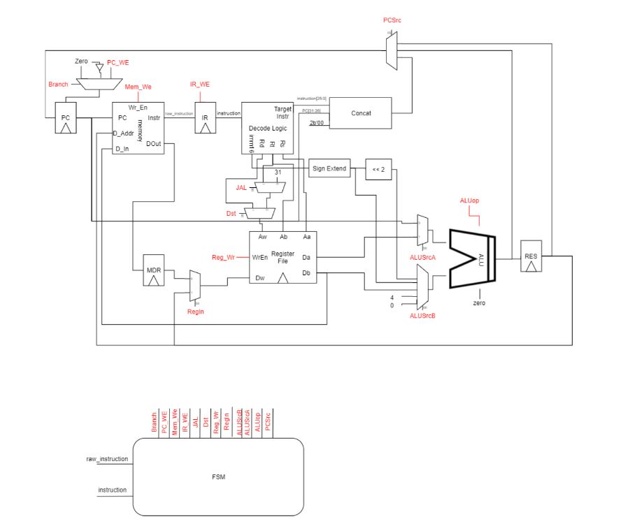

In Olin College's Computer Architecture class, another peer and I designed and implemented a multi-cycle CPU in Verilog and wrote and tested Assembly programs to test it. As opposed to a single-cycle CPU which executes one instruction per clock cycle, the multi-cycle CPU takes a different number of clock cycles to execute different instructions. The schematic for the CPU can be found below:

