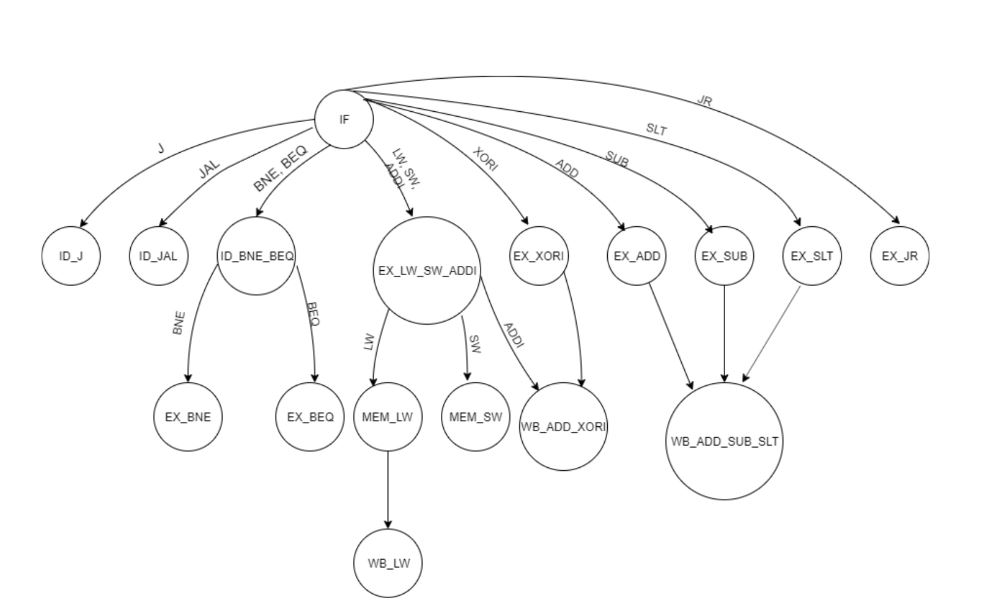

In Olin College's Computer Architecture class, another peer and I designed and implemented a multi-cycle CPU in Verilog and wrote and tested Assembly programs to test it. As opposed to a single-cycle CPU which executes one instruction per clock cycle, the multi-cycle CPU takes a different number of clock cycles to execute different instructions. In order to perform instructions correctly, we also implemented a finite state machine (FSM) to guide the hardwre. The schematic for the CPU can be found below:

Note that we also designed and implemented the arithmatic logic unit (ALU) and register file components. When an instruction is initiated it follows the control signals of the various components in the CPU schematic (shown in red) are altered depending on the state. Then, the next state is determined by the current state and the instruction being executed. The FSM diagram can be seen below:

