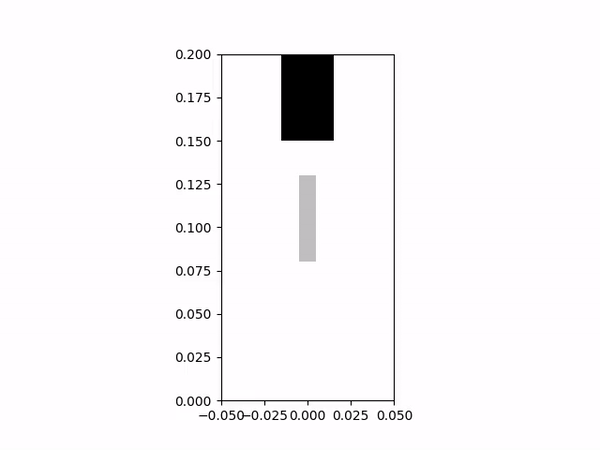
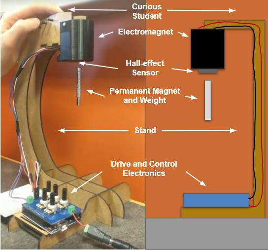
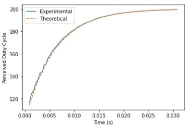

<h2 style="text-align: center;">Animated Simulation</h2>

Above is a simulation of a magnetic levitation apparatus for which another peer and I designed and implemented a controller. Originally, this project was meant to be carried out with a physical apparatus; however, because of the COVID-19 pandemic, a highly realistic simulation of the system was utilized.

The system is shown in the diagram to the left and consists of an electromagnet, a Hall Effect sensor, a permanent magnet, drive control electronics, and a stand to hold the electromagnet in the air. The goal of the project was to change the voltage across the electromagnet such that the permanent magnet levetated a fixed distance from it. 

Over the course of this project my partner and I created a mathematical model for the system as well as our own simulation so that we could test our PD controller. We then further developed our controller on the "real system", which is the simulation provided by our professor, by testing for and applying system parameters. An animated representation of the results of the "real system" simulation is what is shown in the GIF at the top of the page.

One of the main challenges we encountered in controlling the system was utilizing the hall-effect sensor to determine the current distance between the permanent magnet and the electromagnet. In doing this, we created calibration curves to map the PWM input to the electromagnet to the Hall Effect sensor's voltage reading with no permanent magnet present and a mapping between the hall-effect sensor reading and the position of the permanent magnet with the electromagnet off. Using the fact that the magnetic fields from both magnets superimpose to induce a voltage on the Hall Effect sensor, we used a combination of these two mappings to determine the permanent magnet position for any PWM input to the electromagnet.

Another major challenge was in accounting for the dynamics of the electromagnet inductor. As you can see in the graph to the right, when the duty cycle input to the electromagnet is reset, the inductor exhibits a first order response as it approaches the set value. Because our distance estimation of the permanent magnet utilizes the current PWM value of the electromagnet, we needed to model this in our system so that we could use the "effective PWM" signal in this calculation rather than the value it was set to and potentially not yet at. Without doing this, our position estimation of the permanent magnet was inaccurate. In order to account for this we started timers in our control loop after the PWM signal was changed and, by modeling the first order response, were able to estimate the "effective PWM" signal when it was needed to estimate the permanent magnet distance.

The source code can be found below; however, it cannot be run. The simulation which it controls is proprietary to the class, but feel free to reach out to me with any questions! 

Download Source: <a href="../code/ControlTheSystem.ipynb" download> Jupyter Notebook Source Code</a>