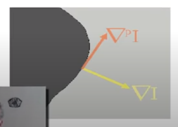

According to a <a href="https://www.mathworks.com/company/newsletters/articles/applying-modern-pde-techniques-to-digital-image-restoration.html" target="_blank">Mathworks article</a> written by Carola-Bibiane Schönlieb, “Inpainting, or image interpolation,is  a  process  used  to  reconstruct  missing  parts  of  images. Artists  have  long  used  manual  inpainting  torestore damaged paintings.  Today, mathematicians apply partial differential equations (PDEs) to automateimage interpolation."

Above is a sample of what the image inpainting algorithm presented in [1] is capable of repairing given Olin College's logo with a chunk taken out of it. The image was produced by a MATLAB implementation of the iterative solution to the inpainting equation presented in the paper. Note that the thin white lines are caused by a bug in our MATLAB code when the mask to delete a portion of the image is applied. Overall, the goal of this project was to create a problem set which walked a student through topics such as inpainting, convolutional kernals, discrete calculus, and calculation of variations. This problem set and the solutions are linked at the bottom of the page and contain links to all the coding exercieses and our proposed solutions.

The problem set culminates with a guided implementation of the algorithm which produced the inpainting at the top of the page. This method is described by the following PDE:

Although the equation may appear intimidating, the qualitative reasoning for its structure is actually quite intuitive. Smoothness is an effective indicator of whether a section of an image or the contours of an image are complete. The creators of this algorithm chose the Laplacian of the image (&Delta;I) as a quantification of its smoothness at a particular point: (x, y).

Next, we want to calculate the change in smoothness across the image by taking the gradient of the Laplacian smoothness measurement which creates the first vector in our equation on which we operate with the dot product (&nabla;(&Delta;I)).

Lastly, we want to project this change in smoothness along the edges present in our image, for along these contours the change in smoothness of the image should be approximately zero when the the image is fully inpainted. Recall that the gradient is always perpendicular to contours as shown in the image to the left, so we want to project &nabla;(&Delta;I) onto the perpendicular gradient which gives the final equation.

In order to iteratively apply this equation to the image, we set it equal to It and take discrete steps in time until we reach steady state (i.e. It = 0).

An additional detail in the implementation of this algorithm is that the "steps" in iteratively solving this inpainting equation are interwoven with anisotropic diffusion in order to ensure correct evolution of the direction field. Anisotropic diffusion, which is sometimes referred to as Perona-Malik diffusion, is a technique which helps to remove image noise without destroying significant elements such as edges and lines. This diffusion is also applied iteratievely and is described by the following equation:

where <i>c(x,y,t)</i> is a scalar field which adjusts the gradient of the image near edges so that these areas do not diffuse as readily, protecting the features. When <i>c(x,y,t)</i> = 1, we are applying isotropic diffusion across the image which is equivalent to applying the two-dimensional heat equation across the image (It = k&Delta;I where <i>k</i> is a constant). This process would not discriminate among the various image features and simply blur the entire image.

For more explanations, exercises, and solutions, download and explore the problem set below that my peer and I developed!

# Citations
[1] Bertalmio M, Sapiro G, Caselles V, Ballester C. Image inpainting. In: Proceedings of conference on computer graphics and interactive techniques. Washington, DC: Addison-Wesley Press; 2000. p. 417–24. 
 
 
[2] P. Perona and J. Malik, “Scale-space and edge detection using anisotropic diffusion,” <i>IEEE  Transactions  on  Pattern  Analysis  and  Machine  Intelligenece</i> <b>12</b>(7),  629–639(1990). 

# Downloads
<a href="../project-pdfs/Image_Inpainting_Problem_Set.pdf" download>Image Inpainting Problem Set</a>
 
<a href="../project-pdfs/Image_Inpainting_Problem_Set_Solutions.pdf" download>Image Inpainting Problem Set Solutions</a>